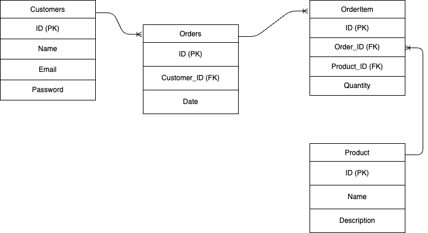
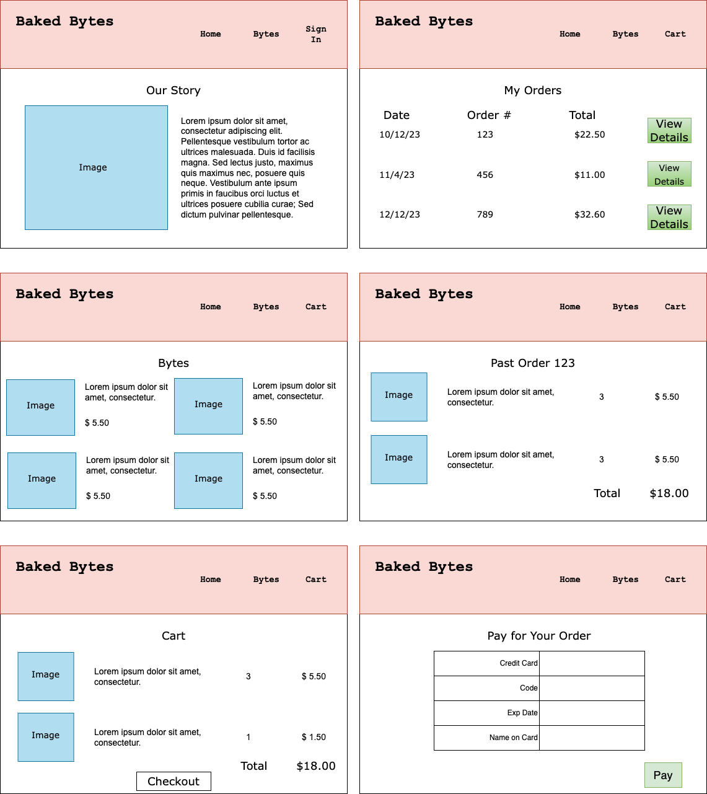
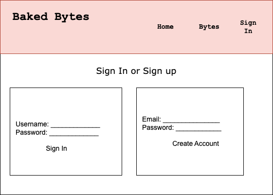

# Baked Bytes
Buy byte-sized pick-me-ups from Baked Bytes. Baked Bytes sells made-to-order baked goods, meaning customers can "buy" treats in a variety of flavor combinations and quantities, like a dozen vanilla cupcakes with chocolate frosting or a sugar cookie with pink frosting and sprinkles.

Baked Bytes uses Postgres for its menu and order history.

## Technologies Used
* Lanaguages: HTML, CSS, Python
* Frameworks: Django
* Authentication: 
* Data Model: PostgreSQL
* APIs: Stripe (https://stripe.com/docs/checkout/embedded/quickstart?lang=python)

## Entity Relationship Diagram (ERD)

## Wireframes

## RESTful Routing Chart
| HTTP METHOD (_Verb_) | URL (_Nouns_)     | CRUD    | Response          | Notes        |
| -------------------- | ----------------- | ------- | ----------------- | ------------ |
| GET | `/checkout` | READ | Directs to checkout page with payment form | |
| GET | `/session-status` | READ | Gets Stripe checkout session | |
| POST | `/create-checout-session` | CREATE | Creates Stripe checkout session | |
| GET | `/bytes` | READ | Loads available bakery items | |
| GET | `/bytes/:id` | READ | Loads item detail page | |
| GET | `/home` | READ | Loads home page with About info | |
| GET | `/cart` | READ | Displays items in the user's cart | |
| POST | `/cart/:id/add` | CREATE | Adds user's selection to their cart | |
| POST | `/cart/:id/update` | CREATE | Updates item quantity in cart | |
| DELETE | `/cart/:id` | DESTROY | Deletes item from user's cart | |
| GET | `/orders` | READ | Previous orders | |
| GET | `/orders/:id` | READ | Loads details of a specific order | |

## User Stories
- [ ] AAU, I want to view available bakery items.
- [ ] AAU, I want to add items to my cart.
- [ ] AAU, I want to purchase items in my cart.
- [ ] AAU, I want to view my order history.
- [ ] AAU, I want to login/logout.
- [ ] AAU, I want to create an account.
- [ ] AAU, I want to pay for my order using a credit card.
- [ ] AAU, I want to select the flavors for my items.

## MVP Goals
- [ ] Users can create an account.
- [ ] Users can login and log out.
- [ ] Users can view items available for purchase.
- [ ] Logged in users can view their order history.
- [ ] Logged in users can add items to their cart.
- [ ] Logged in users can "purchase" items in their cart.

## Stretch Goals (in order of priority)
- [ ] Logged in users can pay for their purchase using Stripe API.
- [ ] Users can create unique combinations of flavors (ex - vanilla cake with chocolate icing).
- [ ] Search functionality.

## Sprints
* Thursday:
    - [x] Create product/order tables in database
    - [x] Seed database with products
    - [ ] Create Home page with static content
    - [x] Create Bytes (products) page (returns data)
* Friday:
    - [x] Implement Django authentication
    - [x] Relate Users to Orders table
    - [ ] Begin styling
* Saturday:
    - [x] Add cart functionality
    - [ ] Practice Stripe API tutorial
* Sunday:
    - [ ] Finish Stripe API tutorial
    - [ ] Implement checkout (no payment)
    - [ ] More styling
* Monday:
    - [x] Implement Order History and Order Detail pages
    - [ ] Implement Stripe API/payment functionality
* Tuesday:
    - [ ] Finish any coding related to checkout and payments
    - [ ] Add images (S3?)
    - [ ] Handle roadblocks / feature overflow
* Wednesday:
    - [ ] Finalize/clean up code
    - [ ] Polish styling

